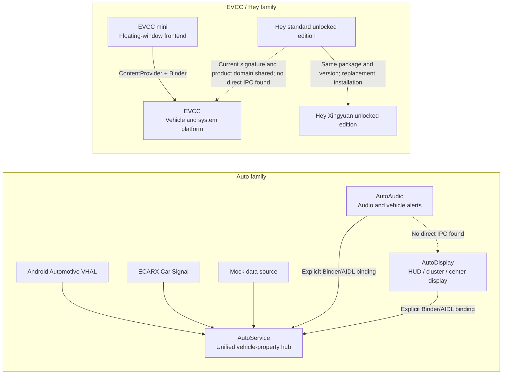

# Static Analysis and Relationship Overview of the Project Software

## 1. Report Scope

This overview covers all seven Android APKs in the project directory. Its purpose is to summarize the role of each application, functional boundaries, key business flows, interface protocols, inter-application dependencies, and relationships with external systems. Implementation details for each APK are provided in the corresponding standalone report.

The analysis was strictly limited to static operations:

- The APK ZIP structure, Manifest, resources, DEX/Smali, static Native ELF information, and signature containers were read;
- Apktool 2.11.1 and JADX 1.5.1 were used for decoding and decompilation;
- Hashes, certificates, file differences, strings, interface classes, and call relationships were checked offline;
- No payload was installed, launched, injected, connected to a vehicle, or executed as Native/DEX/JAR code;
- No requests were sent to any server, broker, gRPC, TCP, WebSocket, or other interface found in the code;
- Only functions, protocols, and software relationships were analyzed. No security, privacy, or compliance assessment was performed.

The confidence levels are the same as those used in the standalone reports:

| Level | Meaning |
|---|---|
| Code-confirmed | Directly supported by the Manifest, Java/Smali, interface classes, JNI declarations, or definitive constants |
| Resource-confirmed | Directly supported by XML, assets, JSON, Proto, DBC, audio, images, or package metadata |
| Reasonable inference | Multiple items of static evidence agree, but no runtime observation is available |
| Cannot be confirmed | Depends on shell decryption, Native encapsulation, cloud configuration, a real vehicle, a server, or runtime state |

## 2. APK Inventory and Exact Identity

| No. | Software | Package name | Version / versionCode | APK SHA-256 | Core role |
|---:|---|---|---|---|---|
| 1 | AutoAudio | `com.simplerbit.autoaudio` | 2.0.2 / 211 | `E37A058D8CDB88D5E464DD08D291D1E51A80CE20A3B151BC0F7B6B5C6FF68104` | Vehicle-event alert sounds, sound themes, in-car karaoke, public-address audio, and audio routing |
| 2 | AutoDisplay | `com.simplerbit.autodisplay` | 3.6.2 / 50 | `39C676B4F1943D2871C4558F4E8934901BADF56EC02B72A57D5FAFB5A000BC6E` | HUD, instrument cluster, center display, multi-screen components, navigation, music, cameras, and screen-casting orchestration |
| 3 | AutoService | `com.simplerbit.autoservice` | 0.1.0 / 20 | `60249EF37B033EB3217348E8426B9E5DE907900288172C956443C8FFCBAD5D4E` | Adaptation of VHAL/ECARX/Mock sources to unified vehicle properties, exposed through a Binder service |
| 4 | EVCC mini | `com.kooo.evcc.mini` | 2.3.8 / 138 | `EAD8D7019C5D92E52D6BE16D250D44FF27DC993AFB72E917DE6542F35A957D4A` | Lightweight floating-window/dashboard rendering and interaction client for EVCC |
| 5 | EVCC | `com.kooo.evcc` | 2.9.46 / 249 | `5EE838B1940C1D9F20B4B4AC67B244218764ABE09856A6951A26D3B0AFD47A4C` | Vehicle control, visualization, automation, system tools, media, screen casting, and remote-integration platform |
| 6 | Hey unlocked edition | `com.kooo.hey` | 1.2.4 / 26 | `A0E5995C40B4FDCD2D238795DE193C3390DB8EF2380C0ECC1FC0C837B83E5A8B` | Real-time external public address, DSP/voice changing, TTS, recording, and music |
| 7 | Hey Xingyuan unlocked edition | `com.kooo.hey` | 1.2.4 / 26 | `F62606E1A24D5BFCBACBBE1716CE7B053F959F9A17B7126D74A3044120E1FB72` | A UI-size/system-window adaptation variant with the same business implementation as the standard Hey edition |

All SHA-256 values were recalculated from and checked against the original APKs.

## 3. Signature Groups

The seven samples form two clearly identifiable current-signature groups:

| Current signature group | APKs | Certificate SHA-256 |
|---|---|---|
| `com.simplerbit.*` group | AutoAudio, AutoDisplay, AutoService | `F9:A0:79:A1:94:DE:39:3F:08:7B:62:06:F4:B6:90:8C:B7:03:78:34:23:95:9F:2E:1A:A8:19:4F:34:4E:E0:7C` |
| `com.kooo.*` group | EVCC, EVCC mini, both Hey variants | `BB:CA:73:98:98:13:6E:6F:84:77:AF:0D:32:53:AE:10:B5:B6:DE:C2:F6:3D:D4:6D:34:FB:5E:AF:83:6C:16:3F` |

The certificate grouping only describes signature consistency among the samples in the current directory.

## 4. Overall Software Relationship Diagram



Solid arrows indicate calls or data dependencies confirmed by static code. Dashed arrows indicate replacement relationships, weak associations, or an explicit absence of discovered direct calls.

## 5. Conclusions on Relationships Within the Project

| Source | Target | Relationship strength | Static evidence | Conclusion |
|---|---|---|---|---|
| AutoAudio | AutoService | Strong dependency | Manifest `<queries>`, explicit package/Service/Action, copied AIDL contract, and subscriptions to 21 properties | AutoService is AutoAudio's vehicle-event data source |
| AutoDisplay | AutoService | Strong dependency | Manifest `<queries>`, explicit binding, AIDL contract, and vehicle-component subscriptions | AutoService is the data source for vehicle displays, buttons, and camera coordination |
| AutoAudio | AutoDisplay | No direct dependency found | No reference to the other package name, Action, Provider, or AIDL | Their functions complement each other, but each consumes AutoService independently |
| EVCC mini | EVCC | Strong dependency | `com.kooo.evcc.config` Provider, `EvccBridgeService`, signature permission, and explicit package-name lookup | mini is EVCC's independent lightweight frontend, not an independent vehicle-protocol implementation |
| Hey standard edition | Hey Xingyuan edition | Replacement relationship | Same package name, version, DEX, and Native code; minor differences in Manifest and size resources | They cannot be installed side by side and use the same business protocols |
| Hey | EVCC / mini | Weak product association | Same current signature and package prefix; the `coauto.cc` product domain appears | No direct Binder, Provider, broadcast, or explicit package call was found |
| Auto family | EVCC / Hey family | No direct dependency found | Different signatures, package names, IPC descriptors, and service targets; business strings form no mutual-call chain | They can only be confirmed as members of the same in-vehicle software collection; runtime interoperability cannot be asserted |

### 5.1 AutoService Call Conditions

Before each transaction, AutoService's exported Binder matches the calling client by UID, package name, and certificate history. The visible allowlist contains the expected distribution-certificate SHA-1 values for AutoAudio and AutoDisplay. However, the three current Auto-family APKs all use the same Android Debug certificate, which is not present in the visible client allowlist.

AutoService also uses the `com.SecShell.SecShell` entry point. The ARM/x86 Native code, the first 22 fields of `gConfig`, and the `JNI_OnLoad -> setup_zipres -> loadDgg/doRegistern2` chain have been statically recovered. `classes0.jar` has also been fully recovered: its first `0x20000` bytes use RC4, and the remainder uses `XOR 0xAC`; the valid key is `05F801C61E2F55C0653FD7B566BFB4C1`. The recovered JAR/DEX passed ZIP CRC32, DEX SHA-1, and Adler32 validation, and JADX produced 802 Java files. The recovered DEX adds no new signature-query proxy class path. Therefore:

- Dependencies at the design, package-name, Action, and AIDL protocol levels are confirmed;
- The final Binder reachability of the currently re-signed samples on a real head unit cannot be confirmed by static analysis alone.

### 5.2 EVCC mini Interface Version Relationship

The `IEvccBridge` copy bundled with mini reports version v5, whereas the service implementation in EVCC v2.9.46 is v11:

- The primary transaction numbers for property subscription, actions, music, and variables are aligned from transactions 1 through 8;
- v11 inserts `getVariablesJson(String[])` at transaction 9, shifting the numbers of subsequent transactions;
- EVCC further extends the interface with transactions for the content store, switch states, page saving, virtual displays, and input injection;
- The current EVCC `onBind()` returns the v11 Stub, and static analysis found no separate v5 compatibility Stub;
- Because neither application was run, mini's actual compatibility with calls after transaction 9 cannot be confirmed.

mini's local `getMiniEntitlementState()` wrapper always returns `active`, while the EVCC service still retains the `none/active/stale/trial/expired` state chain and the subscription-entry check. The fixed client display branch and the server-side state decision must be understood separately.

## 6. Functions and Key Flows by Application

### 6.1 AutoService

AutoService is the data hub of the Auto family. Its core implementation performs the following operations:

1. Selects an underlying data source from Android Automotive VHAL, ECARX Car Signal, or an in-memory Mock;
2. Uses 13 vehicle-model JSON mappings to convert raw propertyId, areaId, type, and numeric values;
3. Normalizes values into `CarPropertyValue` and stores them in the cache and subscription repository;
4. Exposes read, write, subscribe, unsubscribe, and supported-property-list operations through `ICarPropertyService`;
5. Validates the access mode and type for writable properties, then writes the result back to the corresponding lower layer;
6. Provides a debugging Activity for switching vehicle models/data sources, browsing properties, reading, writing, subscribing, and injecting Mock values.

The unified property dictionary contains 73 entries covering vehicle state, powertrain, doors, lighting, tires, lanes, blind spots, physical buttons, charging, energy consumption, and extended controls. `assets/classes0.jar` has been fully recovered statically as a ZIP containing a single `classes.dex`: the first `0x20000` bytes use RC4 and the remainder uses `XOR 0xAC`. The recovered DEX has 839 class_defs, and JADX produced 802 Java files. The recovered class paths overlap almost completely with the visible business DEX; no additional business class path present only in the hidden payload was found.

See [AutoService v0.1.0 static analysis report](../apps/AutoService/analysis/report.en.md).

### 6.2 AutoAudio

AutoAudio converts vehicle states from AutoService into audio behavior. Its main functions are:

- 13 external-vehicle alert slots and 22 in-vehicle alert slots, for a total of 35 actual event-audio slots;
- Custom alert sounds, sound-effect themes, volume, and output-device configuration;
- A vehicle-event state machine covering doors, locking, turn signals/hazard lights, gear, low speed/overspeed, charging, sentry mode, and physical buttons;
- Floating-window music, local audio, in-car karaoke, and external public-address audio;
- A 48 kHz real-time voice chain: `AudioRecord -> AEC/gain/RNNoise -> AudioTrack`;
- ECARX in-vehicle/external media modes and external-vehicle volume-group control;
- Licensing, subscription, redemption, and update flows, plus a temporary LAN HTTP page for activation-code input.

It subscribes to 21 unified properties from AutoService. On the initial binding it actively reads current values, and subsequent callbacks enter the same processing function. That function applies a common sequence: previous-value comparison, master/per-item switches, repetition interval, audio-slot selection, output-device selection, and playback.

See [AutoAudio v2.0.x static analysis report](../apps/AutoAudio/analysis/report.en.md).

### 6.3 AutoDisplay

AutoDisplay is a configurable multi-screen display orchestrator for an in-vehicle head unit, targeting the HUD, instrument cluster, and center display. Its main functions are:

- Layout-capable components for vehicle properties, text, icons, progress, gauges, maps, media, lyrics, cameras, and more;
- Multi-display, virtual-screen, floating-overlay, DPI, and z-order management;
- Three navigation data chains: external Amap broadcasts, an embedded Amap SDK, and an original-vehicle map Hook;
- Android MediaSession, original-vehicle media-center Binder, music-application broadcasts, and online lyrics aggregation;
- Android cameras, QNX cameras, and HAB raw-frame screen casting;
- HUD, button, and camera coordination driven by AutoService vehicle properties;
- Online layout, resource, license, and update flows.

The key display chain is:

```text
AutoService / navigation / media / camera
 -> data normalization
 -> component model and layout configuration
 -> Android View / virtual display
 -> center display, instrument cluster, or HUD
```

See [AutoDisplay v3.6.2 static analysis report](../apps/AutoDisplay/analysis/report.en.md).

### 6.4 EVCC

EVCC has the broadest functional scope in this project and is an Android Automotive platform-style tool. Its main modules include:

- Vehicle-property access through VHAL, APVP, Android CarPropertyManager, ECARX AIDL/CAPI, and other sources;
- A configurable dashboard, property browser, component actions, and expression mapping;
- Triggers for boot, properties, applications, BLE, time, location, media, and other events, plus action-sequence automation;
- The Provider/Binder backend for EVCC mini;
- MediaSession, a media bridge, and desktop lyrics;
- Dashcast, a network secondary display, cross-display mirroring, floating windows, HUD, and AVM;
- Local/remote file management, APK/application management, and an ADB terminal;
- Lua, Frida, a script store, and the shared RootService execution backend;
- MQTT, HTTP/Webhook, DingTalk, Feishu, Telegram, and Home Assistant integrations;
- BLE/UDP/HTTP broadcasting, Midebao device integration, simulated engine sound, dynamic wallpaper, and a content store.

Its architectural core is a "unified property model + shared action-execution layer": different vehicle sources are normalized to `propertyId/areaId/value`; the dashboard, mini, automation, simulated-sound, and remote modules operate around the same model. System-level operations are centralized in RootService, ADB, Android Car, and manufacturer-private interfaces.

`assets/iplm_ctrl.dex` has been recovered as a standalone `app_process` IPLM resource-group command-line tool. No direct reference that loads or executes this file was found in the main DEX, so it cannot be described as a plugin automatically loaded at application startup.

See [EVCC v2.9.46 static analysis report](../apps/EVCC/analysis/evcc.en.md).

### 6.5 EVCC mini

EVCC mini does not directly implement VHAL, MQTT, gRPC, WebSocket, TCP, or Native vehicle protocols. It is responsible for:

- Reading the grid, page JSON, theme, skin, and music-page styles from the EVCC Provider;
- Rendering page JSON as floating-window components;
- Aggregating subscriptions to vehicle properties and system metrics through Binder;
- Wrapping button, switch, slider, drop-down, and button-group operations as `DashboardAction`;
- Receiving music state and sending play/pause/track-change/Seek commands;
- Requesting entry to or exit from a floating window, launching a full-screen package, and opening content;
- Displaying a built-in Demo when no page configuration is available.

Primary flow:

```text
EvccConfigProvider -> page / theme / skin -> mini component tree
EvccBridgeService  -> properties / metrics / music -> mini real-time refresh
mini user action   -> DashboardAction -> EVCC action-execution layer
```

See [EVCC mini v2.3.8 static analysis report](../apps/EVCC/analysis/evcc-mini.en.md).

### 6.6 Hey Standard Unlocked Edition

Hey is a standalone external public-address/amplification application. Its main functions are:

- 48 kHz, 16-bit, mono microphone capture and real-time playback;
- DSP including AEC, gain, filtering, delay, and five voice-changing modes;
- TTS, local WAV recording, local music, and foreground playback;
- A draggable floating button, external broadcast commands, a long press on the steering-wheel OK button, and log-keyword triggers;
- VHAL gRPC button subscription and ECARX external amplifier/audio routing;
- Retained implementations for activation, device migration, heartbeat, log upload, and remote configuration.

Primary real-time public-address chain:

```text
AudioRecord
 -> PCM buffer
 -> AEC / gain / DSP / voice changing
 -> external-vehicle audio route
 -> AudioTrack
```

The Java initial-activation check in the current sample was changed to return success directly, causing the initially inactive branch in `onCreate` to be skipped. However, Native session validation in `onResume` and the startup blacklist recheck may still open the activation page. The original activation, migration, and heartbeat code remains present.

See [Hey v1.2.4 standard unlocked-edition static analysis report](../apps/Hey/analysis/hey-standard.en.md).

### 6.7 Hey Xingyuan Unlocked Edition

The Xingyuan edition has the same package name, versionCode, `classes.dex`, and Native libraries as the standard edition. Its business functions, protocols, audio processing, and licensing modifications are therefore identical. Confirmed differences are:

- The Manifest additionally declares `android.permission.INTERNAL_SYSTEM_WINDOW`;
- Application-size resources for the default, `sw1000dp`, and `sw1400dp` configurations are reduced;
- Most main-screen, panel, dialog, and font dimensions are approximately 70% of those in the standard edition, while many default activation-page dimensions are approximately 50%;
- APK container metadata and signature digests differ as a consequence of the content changes.

The association with the Xingyuan vehicle model is inferred from the filename transliteration and the usage scenario; the APK business code contains no plaintext vehicle-model constant. It can therefore be confirmed as a display/window adaptation variant, while the exact target head-unit model remains a reasonable inference.

See [Hey v1.2.4 Xingyuan unlocked-edition static analysis report](../apps/Hey/analysis/hey-xingyuan.en.md).

## 7. Summary of Key Interface Protocols

### 7.1 Android IPC

| Protocol | Provider | Consumer | Key identifier | Main data/operations |
|---|---|---|---|---|
| AutoService AIDL | AutoService | AutoAudio, AutoDisplay | `com.simplerbit.autoservice.contract.ICarPropertyService` | `getProperty`, `setProperty`, `subscribe`, `unsubscribe`, `getSupportedPropertyIds` |
| AutoService callback | AutoService | AutoAudio, AutoDisplay | `ICarPropertyCallback` | `onPropertyChanged(CarPropertyValue)` |
| EVCC configuration Provider | EVCC | EVCC mini | authority `com.kooo.evcc.config` | `main_info`, `mini_grid`, `mini_pages`, `mini_settings`, `current_skin` |
| EVCC Bridge Binder | EVCC | EVCC mini | `com.kooo.evcc.bridge.IEvccBridge` | Properties, system metrics, actions, variables, music, floating windows, content, virtual displays, input |
| EVCC Artwork Provider | EVCC | EVCC mini | `com.kooo.evcc.artwork` | Cached cover-art URI |
| ECARX/Geely media Binder | Original-vehicle media service | AutoDisplay, EVCC | Multiple manufacturer descriptors | Metadata, progress, lyrics, media commands |
| ECARX audio/amplifier interface | Head-unit system | AutoAudio, Hey | Manufacturer Binder/HIDL/reflection interfaces | In-vehicle/external media modes, amplifier, and audio routing |

The `CarPropertyValue` Parcel order used by AutoService is:

```text
propertyId, valueType, status,
timestampMillis, localUpdateTimestampMillis,
intValue, longValue, floatValue, doubleValue,
boolValue, stringValue, bytesValue
```

Types 1 through 8 correspond to int, long, float, double, boolean, string, bytes, and char respectively. States 1/2/3 correspond to available/unavailable/error.

### 7.2 AutoDisplay Local and QNX Protocols

| Protocol | Address/carrier | Recovered content |
|---|---|---|
| Original-vehicle map Hook line protocol | `127.0.0.1:23791` TCP | `HELLO`, `PING`, `ROUTE`, `LOC`, `LANE`, `GUIDE`, `TL` |
| QNX camera control | Default `192.168.118.2:50020` | `hello` obtains a challenge; `v=2 challenge=... nonce=... mac=... command` |
| Android root helper | `127.0.0.1:50030` | Camera/system-side auxiliary control |
| HAB raw frame | Android Intent | Start/stop projection, target screen, dimensions, fps, slots, z-order |
| Standard Amap navigation | Android broadcast | Location, route, remaining distance/time, road, turn, lane, traffic lights |
| External Amap floating map | Android broadcast | show/close, x/y/w/h/displayId/displayIndex |

### 7.3 Main EVCC Custom Protocols

| Protocol | Transport | Recovered key content |
|---|---|---|
| RootService | LocalServerSocket; fallback `127.0.0.1:40006-40008` | 32-byte challenge, `HMAC-SHA256(challenge, certificate hash)`, big-endian length + UTF-8 JSON, more than 30 command classes |
| VHAL/APVP | gRPC | Vehicle-property read, subscription, and write; some host/port/clientId values are in Native code and cannot be confirmed in plaintext |
| CloudProbe | MQTT `127.0.0.1:1883` | Classification and read-only display of local in-vehicle cloud messages |
| Mini-program MQTT | MQTT/MQTTS, default 8883 | `evcc/<username>/status`, property state, variable state, GPS |
| Home Assistant | MQTT/MQTTS, default 1883 | Auto-discovery, entity state, and control messages returned to the component-action layer |
| Dashcast | H.264 RTP/UDP; BGRA+LZ4/TCP | Virtual-display or rendered frames sent to the instrument cluster/CP |
| Network secondary display | H.264 RTP/JPEG fragments | Network display; every JPEG fragment uses a 16-byte little-endian header containing `0x5354`, reserved field 0, total JPEG length, fragment sequence number, and total fragment count; maximum per-fragment payload is 1400 bytes |
| Feishu persistent connection | WebSocket + Protobuf | `Pbbp2Frame` sequence number, log ID, service, method, headers, encoding, payload |
| Broadcasting hub | BLE, UDP, HTTP | Broadcast of properties, variables, and other data, with configurable UDP source port and return path |
| Midebao | BLE binary frames + AIDL | Direct device transmission and lyrics/media integration |
| Generic automation network action | HTTP/Webhook | method, URL, headers, body, and result processing |

RootService JSON commands cover settings, system properties, Binder/reflection, shell, watchdog, Frida, input injection, Car API, SQLite, tasks/displays, audio, head-unit power, navigation snapshots, and more.

### 7.4 Hey Protocols

| Protocol | Identifier | Content |
|---|---|---|
| VHAL gRPC | Default `localhost:40004`; service `vhal_proto.VehicleServer` | Subscribes to prop `0x21407439` by default; the first `int32Values == 4` is interpreted as a long press on the OK button |
| External commands | Intent/broadcast | `START_TALK`, `STOP_TALK`, `TOGGLE_TALK` |
| ECARX external-vehicle output | Manufacturer HIDL/Binder/audio interface | Amplifier, external media mode, audio output |
| HTTP/JSON | Server address obtained from configuration | Automatic activation, migration confirmation, heartbeat, log upload, and remote configuration |
| Startup blacklist recheck | `POST <getServerUrl>/api/check-blacklist` | Requests `device_id`; activation state is cleared only after `blacklisted=true` is returned twice consecutively |
| Purchase entry point | `https://coauto.cc/` | QR code on the activation page |

The Hey network configuration also contains `suyunkai.top`. Because no network request was sent, the current parsing result, service state, and response structure cannot be validated from the static sample.

## 8. Relationships With External Software and Systems

| Project software | Related software/system | Relationship method |
|---|---|---|
| AutoService | Android Automotive VHAL, ECARX Car Signal | Underlying vehicle-property data sources |
| AutoAudio | ECARX audio/amplifier, Android AudioRecord/AudioTrack | In-vehicle/external routing, karaoke, public address, and alert sounds |
| AutoDisplay | Amap head-unit edition/SDK, original-vehicle map, QNX/HAB | Navigation data, floating map, cameras, instrument-cluster/HUD screen casting |
| AutoDisplay | Android MediaSession, ECARX/Geely media center | Music metadata, progress, lyrics, and controls |
| AutoDisplay | QQ Music head-unit edition, Qishui Music, Kuwo, Kugou, Flyme Auto Music | Broadcast, Provider, or MediaSession adaptation |
| EVCC | Android Car, VHAL, APVP, ECARX AIDL/CAPI | Vehicle-property read/write and unified model |
| EVCC | Home Assistant, DingTalk, Feishu, Telegram | MQTT, HTTP, WebSocket, and bot integrations |
| EVCC | WebDAV, FTP, 123 Cloud Drive, fnOS NAS | Remote file browsing, parsing, and downloading |
| EVCC | Frida, Lua, ADB, frpc | Scripting, terminal, system execution, and intranet tunneling |
| EVCC | Midebao devices, network secondary display, instrument cluster/CP | BLE/AIDL, RTP/JPEG, Dashcast |
| Hey | Local VHAL gRPC, ECARX external amplifier | Steering-wheel triggering and real-time external audio |

## 9. Functional Branch Differences in the Current Builds

This section describes only the sample implementations and does not assess their origin or impact:

- AutoAudio: local licensing-related methods contain direct-success branches; the primary business UI and service operate on the path where license conditions are satisfied. The original licensing, redemption, and update protocols remain present.
- AutoDisplay: multiple license checks were changed to return fixed success, and fixed device/product-signature clues are used. The local layout, navigation, vehicle, music, and screen-casting code remains present.
- AutoService: the visible implementations of `j5.h()` and `j5.j()` always return true and use fixed hardware-ID/product-signature values. License, redemption, and update endpoints remain present. The SecShell ARM/x86 libraries, `gConfig` read chain, and `classes0.jar` have been fully recovered statically; internal JAR/DEX validation and JADX decompilation are complete.
- EVCC mini: the state-query wrapper always returns `active`; the original state chain and subscription-entry check remain on the EVCC service side.
- Both Hey variants: the Java initial-activation check and activation-code acceptance method always return success. Native session validation in `onResume` and the startup blacklist recheck can still open the activation page, and the original automatic activation, migration, heartbeat, and upload implementations remain present.

A locally fixed success state does not establish that remote services, vehicle capabilities, on-demand resources, or cross-process services will necessarily be available.

## 10. Principal Boundaries That Static Analysis Cannot Confirm

1. Whether the SecShell Native/early-injection layer changes signature queries at runtime, and the final Binder connectivity result between the currently re-signed Auto-family APKs and the AutoService allowlist.
2. The actual compatibility outcome of calls after transaction 9 between the EVCC mini v5 interface copy and the EVCC v11 service.
3. Server URLs, gRPC host/port/clientId, license fields, and some configuration plaintext encapsulated in EVCC Native code.
4. The final visible feature set determined by cloud configuration, account state, vehicle-model capabilities, and backend responses.
5. The complete schema of AutoDisplay's on-demand original-vehicle map Hook scripts, and compatibility with the target QNX/HAB/head-unit firmware.
6. Exact mappings from real vehicle models to the unified property enumeration, ECARX private interfaces, window modes, amplifiers, and audio groups.
7. The exact target vehicle model of the Hey Xingyuan edition; "Xingyuan" is inferred only from the filename and UI-adaptation characteristics.
8. Actual online responses for all public-network, LAN, Binder, gRPC, MQTT, WebSocket, BLE, QNX, and screen-casting protocols, because none were executed or connected during this analysis.

## 11. Standalone Report Index

1. [AutoAudio v2.0.x static analysis report](../apps/AutoAudio/analysis/report.en.md)
2. [AutoDisplay v3.6.2 static analysis report](../apps/AutoDisplay/analysis/report.en.md)
3. [AutoService v0.1.0 static analysis report](../apps/AutoService/analysis/report.en.md)
4. [EVCC mini v2.3.8 static analysis report](../apps/EVCC/analysis/evcc-mini.en.md)
5. [EVCC v2.9.46 static analysis report](../apps/EVCC/analysis/evcc.en.md)
6. [Hey v1.2.4 standard unlocked-edition static analysis report](../apps/Hey/analysis/hey-standard.en.md)
7. [Hey v1.2.4 Xingyuan unlocked-edition static analysis report](../apps/Hey/analysis/hey-xingyuan.en.md)

## 12. Audit Materials

Decompilation and decoding evidence is retained in the project root directory:

```text
.analysis-work/
  autoaudio/
  autodisplay/
  autoservice/
  evcc_mini/
  evcc/
  hey_standard/
  hey_variant/

.analysis-tools/
  apktool.jar
  jadx/
  jdk17/
```

These directories are used to verify class names, Smali, the Manifest, resources, protocol models, and static Native clues cited in the reports. They are not a runtime environment, and no software payload within them was launched during the analysis.

## 13. JADX Gap-Recovery Status

Placeholders in the default structured JADX output were cross-covered with `show-bad-code`, `simple`, `fallback`, and smali:

| Software | default placeholders | simple placeholders | Final coverage |
|---|---:|---:|---|
| AutoAudio | 118 | 0 | Fully recovered by simple |
| AutoDisplay | 296 | 4 | All first-party business code recovered; four SDK/drawing methods covered by fallback/smali |
| AutoService | 65 | 1 | show-bad-code/fallback count is 0; all placeholders covered |
| EVCC mini | 149 | 2 | fallback count is 0 |
| EVCC | 1,594 | 22 | fallback count is 0 |
| Hey standard edition | 165 | 4 | All direct business methods recovered; remaining items covered by smali |
| Hey Xingyuan edition | 165 | 4 | Business DEX/smali identical to the standard edition |

The AutoDisplay `GUIDE` field, EVCC JPEG fragment header, and Home Assistant Discovery schema have been upgraded from partial confirmation to code-confirmed status. The fallback deliverable is a register-level static view and does not represent restoration of pre-obfuscation source names or project structure.
