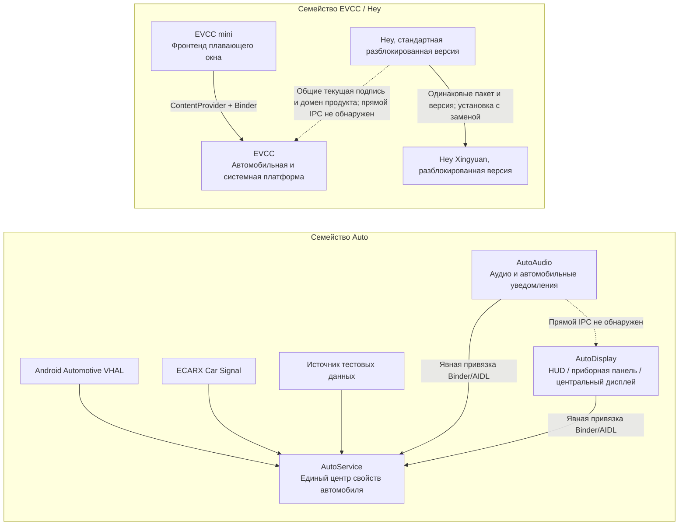

# Обзор статического анализа программ и связей между ними

## 1. Область отчета

Настоящий обзор охватывает все семь Android APK в каталоге проекта. Его цель — свести воедино назначение приложений, границы их функций, ключевые бизнес-процессы, протоколы интерфейсов, зависимости между приложениями и связи с внешними системами. Подробности реализации каждого APK приведены в соответствующем отдельном отчете.

Анализ был строго ограничен статическими операциями:

- Изучены ZIP-структура APK, Manifest, ресурсы, DEX/Smali, статические сведения о Native ELF и контейнеры подписей;
- Для декодирования и декомпиляции использовались Apktool 2.11.1 и JADX 1.5.1;
- Хеши, сертификаты, различия файлов, строки, классы интерфейсов и связи вызовов проверялись автономно;
- Полезные нагрузки не устанавливались, не запускались, не внедрялись, не подключались к автомобилю и не исполнялись как Native/DEX/JAR;
- Запросы к обнаруженным в коде серверам, брокерам, gRPC, TCP, WebSocket и иным интерфейсам не отправлялись;
- Анализировались только функции, протоколы и связи между программами. Оценка безопасности, конфиденциальности или соответствия требованиям не проводилась.

Уровни достоверности совпадают с уровнями в отдельных отчетах:

| Уровень | Значение |
|---|---|
| Подтверждено кодом | Непосредственно подтверждается Manifest, Java/Smali, классами интерфейсов, объявлениями JNI или однозначными константами |
| Подтверждено ресурсами | Непосредственно подтверждается XML, assets, JSON, Proto, DBC, аудио, изображениями или метаданными пакета |
| Обоснованный вывод | Несколько статических свидетельств согласуются между собой, но наблюдения во время выполнения отсутствуют |
| Подтвердить невозможно | Зависит от расшифровки защитной оболочки, Native-обертки, облачной конфигурации, реального автомобиля, сервера или состояния во время выполнения |

## 2. Перечень APK и точная идентификация

| № | Программа | Имя пакета | Версия / versionCode | SHA-256 APK | Основное назначение |
|---:|---|---|---|---|---|
| 1 | AutoAudio | `com.simplerbit.autoaudio` | 2.0.2 / 211 | `E37A058D8CDB88D5E464DD08D291D1E51A80CE20A3B151BC0F7B6B5C6FF68104` | Звуковые уведомления о событиях автомобиля, звуковые темы, автомобильное караоке, громкая связь и маршрутизация аудио |
| 2 | AutoDisplay | `com.simplerbit.autodisplay` | 3.6.2 / 50 | `39C676B4F1943D2871C4558F4E8934901BADF56EC02B72A57D5FAFB5A000BC6E` | Компоновка HUD, приборной панели, центрального дисплея, многодисплейных компонентов, навигации, музыки, камер и трансляции экрана |
| 3 | AutoService | `com.simplerbit.autoservice` | 0.1.0 / 20 | `60249EF37B033EB3217348E8426B9E5DE907900288172C956443C8FFCBAD5D4E` | Адаптация источников VHAL/ECARX/Mock к единой модели свойств автомобиля и предоставление Binder-сервиса |
| 4 | EVCC mini | `com.kooo.evcc.mini` | 2.3.8 / 138 | `EAD8D7019C5D92E52D6BE16D250D44FF27DC993AFB72E917DE6542F35A957D4A` | Облегченный клиент EVCC для отрисовки и взаимодействия в плавающем окне или на приборной панели |
| 5 | EVCC | `com.kooo.evcc` | 2.9.46 / 249 | `5EE838B1940C1D9F20B4B4AC67B244218764ABE09856A6951A26D3B0AFD47A4C` | Платформа для управления автомобилем, визуализации, автоматизации, системных инструментов, мультимедиа, трансляции экрана и удаленных интеграций |
| 6 | Hey, разблокированная версия | `com.kooo.hey` | 1.2.4 / 26 | `A0E5995C40B4FDCD2D238795DE193C3390DB8EF2380C0ECC1FC0C837B83E5A8B` | Громкая связь вне автомобиля в реальном времени, DSP/изменение голоса, TTS, запись и музыка |
| 7 | Hey Xingyuan, разблокированная версия | `com.kooo.hey` | 1.2.4 / 26 | `F62606E1A24D5BFCBACBBE1716CE7B053F959F9A17B7126D74A3044120E1FB72` | Вариант с адаптацией размеров интерфейса и системного окна, использующий ту же бизнес-реализацию, что и стандартная версия Hey |

Все значения SHA-256 были повторно вычислены по исходным APK и сверены.

## 3. Группы подписей

Семь образцов образуют две четко определяемые группы текущих подписей:

| Группа текущей подписи | APK | SHA-256 сертификата |
|---|---|---|
| Группа `com.simplerbit.*` | AutoAudio, AutoDisplay, AutoService | `F9:A0:79:A1:94:DE:39:3F:08:7B:62:06:F4:B6:90:8C:B7:03:78:34:23:95:9F:2E:1A:A8:19:4F:34:4E:E0:7C` |
| Группа `com.kooo.*` | EVCC, EVCC mini, оба варианта Hey | `BB:CA:73:98:98:13:6E:6F:84:77:AF:0D:32:53:AE:10:B5:B6:DE:C2:F6:3D:D4:6D:34:FB:5E:AF:83:6C:16:3F` |

Группировка сертификатов описывает только согласованность подписей образцов в текущем каталоге.

## 4. Общая схема связей между программами



Сплошные стрелки обозначают вызовы или зависимости данных, подтвержденные статическим кодом. Пунктирные стрелки обозначают отношения замены, слабые связи или явно зафиксированное отсутствие обнаруженных прямых вызовов.

## 5. Выводы о связях внутри проекта

| Источник | Цель | Сила связи | Статические свидетельства | Вывод |
|---|---|---|---|---|
| AutoAudio | AutoService | Сильная зависимость | Manifest `<queries>`, явные пакет/Service/Action, скопированный контракт AIDL, подписки на 21 свойство | AutoService служит источником данных о событиях автомобиля для AutoAudio |
| AutoDisplay | AutoService | Сильная зависимость | Manifest `<queries>`, явная привязка, контракт AIDL, подписки автомобильных компонентов | AutoService служит источником данных для отображения состояния автомобиля, кнопок и согласованной работы камер |
| AutoAudio | AutoDisplay | Прямая зависимость не обнаружена | Нет ссылок на имя пакета, Action, Provider или AIDL другого приложения | Приложения функционально дополняют друг друга, но независимо используют AutoService |
| EVCC mini | EVCC | Сильная зависимость | Provider `com.kooo.evcc.config`, `EvccBridgeService`, разрешение уровня подписи, явный поиск имени пакета | mini — отдельный облегченный фронтенд EVCC, а не самостоятельная реализация автомобильного протокола |
| Стандартная версия Hey | Версия Hey Xingyuan | Отношение замены | Одинаковые имя пакета, версия, DEX и Native-код; небольшие различия в Manifest и ресурсах размеров | Их нельзя установить одновременно; бизнес-протоколы совпадают |
| Hey | EVCC / mini | Слабая продуктовая связь | Одинаковая текущая подпись, одинаковый префикс пакетов, присутствует продуктовый домен `coauto.cc` | Прямых вызовов Binder, Provider, широковещательных сообщений или явных пакетных вызовов не обнаружено |
| Семейство Auto | Семейство EVCC / Hey | Прямая зависимость не обнаружена | Различаются подписи, имена пакетов, дескрипторы IPC и цели сервисов; бизнес-строки не образуют цепочку взаимных вызовов | Можно подтвердить только принадлежность к одному набору ПО для головных устройств; взаимодействие во время выполнения утверждать нельзя |

### 5.1 Условия вызова AutoService

Перед каждой транзакцией экспортированный Binder AutoService сопоставляет клиента по UID вызывающей стороны, имени пакета и истории сертификатов. Видимый список разрешенных клиентов содержит ожидаемые SHA-1 сертификатов распространения AutoAudio и AutoDisplay. Однако все три текущих APK семейства Auto используют один сертификат Android Debug, которого нет в видимом списке разрешенных клиентов.

Кроме того, AutoService использует точку входа `com.SecShell.SecShell`. Статически восстановлены ARM/x86 Native-код, первые 22 поля `gConfig` и цепочка `JNI_OnLoad -> setup_zipres -> loadDgg/doRegistern2`. Файл `classes0.jar` также полностью восстановлен: первые `0x20000` байт используют RC4, оставшаяся часть — `XOR 0xAC`; действительный ключ — `05F801C61E2F55C0653FD7B566BFB4C1`. Восстановленные JAR/DEX прошли проверки ZIP CRC32, DEX SHA-1 и Adler32; JADX создал 802 Java-файла. Восстановленный DEX не добавляет нового пути класса-посредника для запросов подписи. Следовательно:

- Подтверждены зависимости на уровнях архитектуры, имени пакета, Action и протокола AIDL;
- Окончательную доступность Binder для текущих повторно подписанных образцов на реальном головном устройстве невозможно подтвердить только статическим анализом.

### 5.2 Связь версий интерфейса EVCC mini

Встроенная в mini копия `IEvccBridge` сообщает версию v5, тогда как реализация сервиса в EVCC v2.9.46 имеет версию v11:

- Основные номера транзакций подписки на свойства, действий, музыки и переменных совпадают для транзакций с 1 по 8;
- В v11 на позиции транзакции 9 добавлен `getVariablesJson(String[])`, из-за чего номера последующих транзакций сдвинуты;
- EVCC дополнительно расширяет интерфейс транзакциями для магазина содержимого, состояний переключателей, сохранения страниц, виртуальных дисплеев и внедрения ввода;
- Текущий `onBind()` EVCC возвращает Stub версии v11; отдельный Stub совместимости с v5 статически не обнаружен;
- Поскольку оба приложения не запускались, фактическую совместимость mini с вызовами после транзакции 9 подтвердить невозможно.

Локальная обертка mini `getMiniEntitlementState()` всегда возвращает `active`, однако сервис EVCC сохраняет цепочку состояний `none/active/stale/trial/expired` и проверку на входе подписки. Фиксированную ветвь отображения клиента и серверное решение о состоянии следует рассматривать раздельно.

## 6. Функции и ключевые процессы по приложениям

### 6.1 AutoService

AutoService — центр данных семейства Auto. Его основная реализация выполняет следующие операции:

1. Выбирает нижележащий источник данных: Android Automotive VHAL, ECARX Car Signal или Mock в памяти;
2. Применяет 13 JSON-сопоставлений моделей автомобилей для преобразования исходных propertyId, areaId, типа и числовых значений;
3. Нормализует значения в `CarPropertyValue` и помещает их в кеш и репозиторий подписок;
4. Через `ICarPropertyService` предоставляет чтение, запись, подписку, отмену подписки и список поддерживаемых свойств;
5. Для записываемых свойств проверяет режим доступа и тип, после чего записывает результат в соответствующий нижний слой;
6. Предоставляет отладочную Activity для переключения модели автомобиля и источника данных, просмотра свойств, чтения, записи, подписки и внедрения Mock-значений.

Единый словарь свойств содержит 73 позиции и охватывает состояние автомобиля, силовую установку, двери, освещение, шины, полосы движения, слепые зоны, физические кнопки, зарядку, энергопотребление и расширенные элементы управления. `assets/classes0.jar` полностью статически восстановлен как ZIP с единственным `classes.dex`: первые `0x20000` байт используют RC4, оставшаяся часть — `XOR 0xAC`. В восстановленном DEX имеется 839 class_defs, а JADX создал 802 Java-файла. Пути восстановленных классов почти полностью совпадают с видимым бизнес-DEX; дополнительных путей бизнес-классов, присутствующих только в скрытой полезной нагрузке, не обнаружено.

См. [отчет о статическом анализе AutoService v0.1.0](../apps/AutoService/analysis/report.ru.md).

### 6.2 AutoAudio

AutoAudio преобразует состояния автомобиля из AutoService в звуковое поведение. Основные функции:

- 13 слотов внешних автомобильных уведомлений и 22 слота уведомлений в салоне — всего 35 фактических слотов звуков событий;
- Пользовательские звуки уведомлений, темы звуковых эффектов, громкость и настройка устройства вывода;
- Автомат состояний автомобильных событий: двери, запирание, указатели поворота/аварийная сигнализация, передача, низкая скорость/превышение скорости, зарядка, режим охраны и физические кнопки;
- Музыка в плавающем окне, локальное аудио, караоке в салоне и внешняя громкая связь;
- Голосовая цепочка реального времени 48 кГц: `AudioRecord -> AEC/усиление/RNNoise -> AudioTrack`;
- Режимы мультимедиа ECARX в салоне/снаружи и управление группой громкости внешнего аудио;
- Процессы лицензирования, подписки, активации кодом и обновления, а также временная HTTP-страница в локальной сети для ввода кода активации.

Приложение подписывается на 21 унифицированное свойство AutoService. При первой привязке оно активно считывает текущие значения, а последующие обратные вызовы поступают в ту же функцию обработки. Затем выполняется единая последовательность: сравнение с предыдущим значением, общий и индивидуальный переключатели, интервал повторения, выбор звукового слота, выбор устройства вывода и воспроизведение.

См. [отчет о статическом анализе AutoAudio v2.0.x](../apps/AutoAudio/analysis/report.ru.md).

### 6.3 AutoDisplay

AutoDisplay — настраиваемый оркестратор многодисплейного вывода головного устройства, предназначенный для HUD, приборной панели и центрального дисплея. Основные функции:

- Компоненты с настраиваемой компоновкой для свойств автомобиля, текста, значков, прогресса, шкал, карт, мультимедиа, текстов песен, камер и других данных;
- Управление несколькими дисплеями, виртуальными экранами, плавающими наложениями, DPI и z-order;
- Три цепочки навигационных данных: внешние широковещательные сообщения Amap, встроенный SDK Amap и Hook штатной карты;
- Android MediaSession, Binder штатного медиацентра, широковещательные сообщения музыкальных приложений и агрегация текстов песен из сети;
- Камеры Android, камеры QNX и трансляция необработанных кадров HAB;
- Согласованное управление HUD, кнопками и камерами по свойствам автомобиля из AutoService;
- Сетевые процессы получения компоновок, ресурсов, лицензий и обновлений.

Ключевая цепочка отображения:

```text
AutoService / навигация / мультимедиа / камера
 -> нормализация данных
 -> модель компонентов и конфигурация компоновки
 -> Android View / виртуальный дисплей
 -> центральный дисплей, приборная панель или HUD
```

См. [отчет о статическом анализе AutoDisplay v3.6.2](../apps/AutoDisplay/analysis/report.ru.md).

### 6.4 EVCC

EVCC обладает самым широким набором функций в проекте и представляет собой платформенный инструмент для Android Automotive. Основные модули:

- Доступ к свойствам автомобиля через VHAL, APVP, Android CarPropertyManager, ECARX AIDL/CAPI и другие источники;
- Настраиваемая панель управления, обозреватель свойств, действия компонентов и сопоставление выражений;
- Триггеры загрузки, свойств, приложений, BLE, времени, местоположения, мультимедиа и других событий, а также автоматизация последовательностей действий;
- Серверная часть Provider/Binder для EVCC mini;
- MediaSession, медиамост и текст песни на рабочем столе;
- Dashcast, сетевой дополнительный дисплей, дублирование между дисплеями, плавающие окна, HUD и AVM;
- Управление локальными/удаленными файлами, APK/приложениями и терминал ADB;
- Lua, Frida, магазин сценариев и общий исполнительный сервер RootService;
- Интеграции MQTT, HTTP/Webhook, DingTalk, Feishu, Telegram и Home Assistant;
- Вещание по BLE/UDP/HTTP, интеграция с устройствами Midebao, имитация звука двигателя, динамические обои и магазин содержимого.

Основа архитектуры — «единая модель свойств + общий слой выполнения действий»: разные автомобильные источники нормализуются в `propertyId/areaId/value`; панель управления, mini, автоматизация, модуль имитации звука и удаленные модули работают с одной моделью. Системные операции сосредоточены в RootService, ADB, Android Car и закрытых интерфейсах производителя.

`assets/iplm_ctrl.dex` восстановлен как самостоятельная утилита командной строки `app_process` для групп ресурсов IPLM. В основном DEX не обнаружено прямых ссылок, загружающих или исполняющих этот файл, поэтому его нельзя описывать как плагин, автоматически загружаемый при запуске приложения.

См. [отчет о статическом анализе EVCC v2.9.46](../apps/EVCC/analysis/evcc.ru.md).

### 6.5 EVCC mini

EVCC mini не реализует напрямую VHAL, MQTT, gRPC, WebSocket, TCP или Native-протоколы автомобиля. Оно выполняет следующие задачи:

- Считывает из EVCC Provider сетку, JSON страниц, тему, оформление и стили музыкальной страницы;
- Отрисовывает JSON страницы в виде компонентов плавающего окна;
- Через Binder агрегирует подписки на свойства автомобиля и системные показатели;
- Упаковывает операции с кнопками, переключателями, ползунками, раскрывающимися списками и группами кнопок в `DashboardAction`;
- Получает состояние музыки и отправляет команды воспроизведения/паузы/переключения композиции/Seek;
- Запрашивает вход в плавающее окно и выход из него, запуск полноэкранного пакета и открытие содержимого;
- При отсутствии конфигурации страницы показывает встроенную Demo.

Основной процесс:

```text
EvccConfigProvider -> страница / тема / оформление -> дерево компонентов mini
EvccBridgeService  -> свойства / показатели / музыка -> обновление mini в реальном времени
действие пользователя mini -> DashboardAction -> слой выполнения действий EVCC
```

См. [отчет о статическом анализе EVCC mini v2.3.8](../apps/EVCC/analysis/evcc-mini.ru.md).

### 6.6 Hey, стандартная разблокированная версия

Hey — самостоятельное приложение для внешней громкой связи и усиления звука. Основные функции:

- Захват с микрофона и воспроизведение в реальном времени: 48 кГц, 16 бит, один канал;
- DSP, включая AEC, усиление, фильтрацию, задержку и пять режимов изменения голоса;
- TTS, локальная запись WAV, локальная музыка и воспроизведение в приоритетном режиме;
- Перетаскиваемая плавающая кнопка, внешние широковещательные команды, длительное нажатие кнопки OK на руле и триггеры по ключевым словам журнала;
- Подписка на кнопки через VHAL gRPC и управление внешним усилителем/маршрутизацией аудио ECARX;
- Сохраненные реализации активации, переноса устройства, heartbeat, отправки журналов и удаленной конфигурации.

Основная цепочка громкой связи в реальном времени:

```text
AudioRecord
 -> буфер PCM
 -> AEC / усиление / DSP / изменение голоса
 -> внешний аудиомаршрут автомобиля
 -> AudioTrack
```

Начальная Java-проверка активации в текущем образце изменена так, чтобы сразу возвращать успех; поэтому начальная неактивированная ветвь `onCreate` пропускается. Однако проверка Native-сеанса в `onResume` и повторная проверка черного списка при запуске все еще могут открыть страницу активации. Исходный код активации, переноса и heartbeat сохранен.

См. [отчет о статическом анализе стандартной разблокированной версии Hey v1.2.4](../apps/Hey/analysis/hey-standard.ru.md).

### 6.7 Hey Xingyuan, разблокированная версия

Версия Xingyuan имеет те же имя пакета, versionCode, `classes.dex` и Native-библиотеки, что и стандартная версия. Следовательно, бизнес-функции, протоколы, обработка аудио и изменения лицензирования совпадают. Подтверждены следующие различия:

- В Manifest дополнительно объявлено разрешение `android.permission.INTERNAL_SYSTEM_WINDOW`;
- Уменьшены ресурсы размеров приложения для конфигураций по умолчанию, `sw1000dp` и `sw1400dp`;
- Большинство размеров главного экрана, панелей, диалогов и шрифтов составляют примерно 70% от стандартной версии, а многие размеры страницы активации по умолчанию — примерно 50%;
- Метаданные контейнера APK и дайджесты подписи изменились вследствие изменения содержимого.

Связь с моделью автомобиля Xingyuan выведена из транслитерации имени файла и предполагаемого сценария; бизнес-код APK не содержит открытой константы модели автомобиля. Поэтому можно подтвердить, что это вариант адаптации отображения и окна, тогда как точная модель целевого головного устройства остается обоснованным выводом.

См. [отчет о статическом анализе разблокированной версии Hey Xingyuan v1.2.4](../apps/Hey/analysis/hey-xingyuan.ru.md).

## 7. Сводка ключевых протоколов интерфейсов

### 7.1 Android IPC

| Протокол | Поставщик | Потребитель | Ключевой идентификатор | Основные данные/операции |
|---|---|---|---|---|
| AutoService AIDL | AutoService | AutoAudio, AutoDisplay | `com.simplerbit.autoservice.contract.ICarPropertyService` | `getProperty`, `setProperty`, `subscribe`, `unsubscribe`, `getSupportedPropertyIds` |
| Обратный вызов AutoService | AutoService | AutoAudio, AutoDisplay | `ICarPropertyCallback` | `onPropertyChanged(CarPropertyValue)` |
| Provider конфигурации EVCC | EVCC | EVCC mini | authority `com.kooo.evcc.config` | `main_info`, `mini_grid`, `mini_pages`, `mini_settings`, `current_skin` |
| EVCC Bridge Binder | EVCC | EVCC mini | `com.kooo.evcc.bridge.IEvccBridge` | Свойства, системные показатели, действия, переменные, музыка, плавающие окна, содержимое, виртуальные дисплеи, ввод |
| EVCC Artwork Provider | EVCC | EVCC mini | `com.kooo.evcc.artwork` | URI кешированной обложки |
| Мультимедийный Binder ECARX/Geely | Штатный медиасервис автомобиля | AutoDisplay, EVCC | Несколько дескрипторов производителя | Метаданные, ход воспроизведения, тексты песен, мультимедийные команды |
| Интерфейс аудио/усилителя ECARX | Система головного устройства | AutoAudio, Hey | Интерфейсы Binder/HIDL/рефлексии производителя | Режимы мультимедиа в салоне/снаружи, усилитель и маршрутизация аудио |

Порядок полей Parcel `CarPropertyValue` в AutoService:

```text
propertyId, valueType, status,
timestampMillis, localUpdateTimestampMillis,
intValue, longValue, floatValue, doubleValue,
boolValue, stringValue, bytesValue
```

Типы с 1 по 8 соответствуют int, long, float, double, boolean, string, bytes и char. Состояния 1/2/3 соответствуют available/unavailable/error.

### 7.2 Локальные протоколы AutoDisplay и протоколы QNX

| Протокол | Адрес/носитель | Восстановленное содержимое |
|---|---|---|
| Строчный протокол Hook штатной карты | TCP `127.0.0.1:23791` | `HELLO`, `PING`, `ROUTE`, `LOC`, `LANE`, `GUIDE`, `TL` |
| Управление камерой QNX | По умолчанию `192.168.118.2:50020` | `hello` получает challenge; `v=2 challenge=... nonce=... mac=... command` |
| Android root helper | `127.0.0.1:50030` | Вспомогательное управление камерой и системной частью |
| HAB raw frame | Android Intent | Запуск/остановка проекции, целевой экран, размеры, fps, slots, z-order |
| Стандартная навигация Amap | Широковещательное сообщение Android | Местоположение, маршрут, оставшиеся расстояние/время, дорога, поворот, полоса, светофоры |
| Внешняя плавающая карта Amap | Широковещательное сообщение Android | show/close, x/y/w/h/displayId/displayIndex |

### 7.3 Основные пользовательские протоколы EVCC

| Протокол | Транспорт | Восстановленное ключевое содержимое |
|---|---|---|
| RootService | LocalServerSocket; резерв `127.0.0.1:40006-40008` | 32-байтовый challenge, `HMAC-SHA256(challenge, хеш сертификата)`, длина big-endian + JSON UTF-8, более 30 классов команд |
| VHAL/APVP | gRPC | Чтение, подписка и запись свойств автомобиля; часть значений host/port/clientId находится в Native-коде и не может быть подтверждена в открытом виде |
| CloudProbe | MQTT `127.0.0.1:1883` | Классификация и представление только для чтения локальных облачных сообщений в автомобиле |
| MQTT мини-программы | MQTT/MQTTS, по умолчанию 8883 | `evcc/<username>/status`, state свойства, state переменной, GPS |
| Home Assistant | MQTT/MQTTS, по умолчанию 1883 | Автоматическое обнаружение, состояние сущностей и возврат управляющих сообщений на слой действий компонентов |
| Dashcast | H.264 RTP/UDP; BGRA+LZ4/TCP | Отправка виртуального дисплея или отрисованных кадров на приборную панель/CP |
| Сетевой дополнительный дисплей | H.264 RTP/JPEG-фрагменты | Сетевое отображение; каждый JPEG-фрагмент использует 16-байтовый заголовок little-endian: `0x5354`, зарезервированное поле 0, общая длина JPEG, порядковый номер фрагмента, общее число фрагментов; максимальная полезная нагрузка одного фрагмента — 1400 байт |
| Постоянное соединение Feishu | WebSocket + Protobuf | Порядковый номер `Pbbp2Frame`, ID журнала, service, method, headers, encoding, payload |
| Центр вещания | BLE, UDP, HTTP | Вещание свойств, переменных и других данных; настраиваемые исходный порт UDP и обратная передача |
| Midebao | Двоичные кадры BLE + AIDL | Прямая передача на устройство и интеграция текстов песен/мультимедиа |
| Универсальное сетевое действие автоматизации | HTTP/Webhook | method, URL, headers, body и обработка результата |

JSON-команды RootService охватывают settings, system property, Binder/рефлексию, shell, watchdog, Frida, внедрение ввода, Car API, SQLite, задачи/дисплеи, аудио, питание головного устройства, снимки навигации и другие операции.

### 7.4 Протоколы Hey

| Протокол | Идентификатор | Содержимое |
|---|---|---|
| VHAL gRPC | По умолчанию `localhost:40004`; сервис `vhal_proto.VehicleServer` | По умолчанию подписывается на prop `0x21407439`; первое `int32Values == 4` трактуется как длительное нажатие кнопки OK |
| Внешние команды | Intent/широковещательное сообщение | `START_TALK`, `STOP_TALK`, `TOGGLE_TALK` |
| Внешний автомобильный вывод ECARX | Интерфейс HIDL/Binder/аудио производителя | Усилитель, внешний режим мультимедиа, вывод аудио |
| HTTP/JSON | Адрес сервера, полученный из конфигурации | Автоматическая активация, подтверждение переноса, heartbeat, отправка журналов и удаленная конфигурация |
| Повторная проверка черного списка при запуске | `POST <getServerUrl>/api/check-blacklist` | Запрашивается `device_id`; состояние активации очищается только после двух последовательных ответов `blacklisted=true` |
| Точка входа для покупки | `https://coauto.cc/` | QR-код на странице активации |

В сетевой конфигурации Hey также встречается `suyunkai.top`. Поскольку сетевые запросы не отправлялись, текущий результат разбора, состояние сервиса и структуру ответа нельзя проверить по статическому образцу.

## 8. Связи с внешними программами и системами

| Программа проекта | Связанная программа/система | Способ связи |
|---|---|---|
| AutoService | Android Automotive VHAL, ECARX Car Signal | Нижележащие источники данных о свойствах автомобиля |
| AutoAudio | Аудио/усилитель ECARX, Android AudioRecord/AudioTrack | Маршрутизация в салоне/снаружи, караоке, громкая связь и звуки уведомлений |
| AutoDisplay | Версия Amap для головных устройств/SDK, штатная карта, QNX/HAB | Навигационные данные, плавающая карта, камеры, трансляция на приборную панель/HUD |
| AutoDisplay | Android MediaSession, медиацентр ECARX/Geely | Метаданные музыки, ход воспроизведения, тексты песен и управление |
| AutoDisplay | Версия QQ Music для головных устройств, Qishui Music, Kuwo, Kugou, Flyme Auto Music | Адаптация через широковещательные сообщения, Provider или MediaSession |
| EVCC | Android Car, VHAL, APVP, ECARX AIDL/CAPI | Чтение/запись свойств автомобиля и единая модель |
| EVCC | Home Assistant, DingTalk, Feishu, Telegram | Интеграции MQTT, HTTP, WebSocket и ботов |
| EVCC | WebDAV, FTP, 123 Cloud Drive, fnOS NAS | Просмотр, разбор и загрузка удаленных файлов |
| EVCC | Frida, Lua, ADB, frpc | Сценарии, терминал, системное выполнение и туннелирование во внутреннюю сеть |
| EVCC | Устройства Midebao, сетевой дополнительный дисплей, приборная панель/CP | BLE/AIDL, RTP/JPEG, Dashcast |
| Hey | Локальный VHAL gRPC, внешний усилитель ECARX | Запуск с рулевого колеса и внешнее аудио в реальном времени |

## 9. Различия функциональных ветвей в текущих сборках

В этом разделе описываются только реализации образцов без оценки их происхождения или влияния:

- AutoAudio: методы, относящиеся к локальной лицензии, содержат ветви прямого успешного результата; основной бизнес-интерфейс и сервис работают по пути, на котором условия лицензии выполнены. Исходные протоколы лицензирования, активации кодом и обновления сохранены.
- AutoDisplay: несколько проверок лицензии изменены так, чтобы возвращать фиксированный успех, и используются фиксированные признаки устройства/подписи продукта. Локальный код компоновки, навигации, автомобиля, музыки и трансляции экрана сохранен.
- AutoService: видимые реализации `j5.h()` и `j5.j()` всегда возвращают true и используют фиксированные значения аппаратного ID/подписи продукта. Конечные точки лицензии, активации кодом и обновления сохранены. Библиотеки SecShell для ARM/x86, цепочка чтения `gConfig` и `classes0.jar` полностью статически восстановлены; внутренняя проверка JAR/DEX и декомпиляция JADX завершены.
- EVCC mini: обертка запроса состояния всегда возвращает `active`; исходная цепочка состояний и проверка на входе подписки сохранены на стороне сервиса EVCC.
- Оба варианта Hey: Java-проверка начальной активации и метод принятия кода активации всегда возвращают успех. Проверка Native-сеанса в `onResume` и повторная проверка черного списка при запуске все еще могут открыть страницу активации; исходные реализации автоматической активации, переноса, heartbeat и отправки данных также сохранены.

Локально зафиксированное успешное состояние не доказывает обязательную доступность удаленных сервисов, возможностей автомобиля, ресурсов по запросу или межпроцессных сервисов.

## 10. Основные границы статического анализа

1. Изменяет ли Native-слой/слой раннего внедрения SecShell запросы подписи во время выполнения, а также окончательный результат Binder-соединения между текущими повторно подписанными APK семейства Auto и списком разрешенных клиентов AutoService.
2. Фактический результат совместимости вызовов после транзакции 9 между копией интерфейса EVCC mini v5 и сервисом EVCC v11.
3. URL серверов, gRPC host/port/clientId, поля лицензии и часть открытой конфигурации, инкапсулированные в Native-коде EVCC.
4. Итоговый видимый набор функций, определяемый облачной конфигурацией, состоянием учетной записи, возможностями модели автомобиля и ответами серверной части.
5. Полная schema загружаемых по запросу Hook-сценариев штатной карты AutoDisplay и совместимость с целевой прошивкой QNX/HAB/головного устройства.
6. Точные сопоставления реальных моделей автомобилей с единой номенклатурой свойств, закрытыми интерфейсами ECARX, оконными режимами, усилителями и аудиогруппами.
7. Точная целевая модель автомобиля для версии Hey Xingyuan; связь с Xingyuan выведена только из имени файла и особенностей адаптации интерфейса.
8. Фактические сетевые ответы всех протоколов публичной сети, LAN, Binder, gRPC, MQTT, WebSocket, BLE, QNX и трансляции экрана, поскольку во время анализа они не исполнялись и соединения не устанавливались.

## 11. Указатель отдельных отчетов

1. [Отчет о статическом анализе AutoAudio v2.0.x](../apps/AutoAudio/analysis/report.ru.md)
2. [Отчет о статическом анализе AutoDisplay v3.6.2](../apps/AutoDisplay/analysis/report.ru.md)
3. [Отчет о статическом анализе AutoService v0.1.0](../apps/AutoService/analysis/report.ru.md)
4. [Отчет о статическом анализе EVCC mini v2.3.8](../apps/EVCC/analysis/evcc-mini.ru.md)
5. [Отчет о статическом анализе EVCC v2.9.46](../apps/EVCC/analysis/evcc.ru.md)
6. [Отчет о статическом анализе стандартной разблокированной версии Hey v1.2.4](../apps/Hey/analysis/hey-standard.ru.md)
7. [Отчет о статическом анализе разблокированной версии Hey Xingyuan v1.2.4](../apps/Hey/analysis/hey-xingyuan.ru.md)

## 12. Материалы аудита

Материалы декомпиляции и декодирования сохранены в корневом каталоге проекта:

```text
.analysis-work/
  autoaudio/
  autodisplay/
  autoservice/
  evcc_mini/
  evcc/
  hey_standard/
  hey_variant/

.analysis-tools/
  apktool.jar
  jadx/
  jdk17/
```

Эти каталоги используются для проверки имен классов, Smali, Manifest, ресурсов, моделей протоколов и статических признаков Native, упомянутых в отчетах. Они не являются средой выполнения; в ходе анализа программные нагрузки из них не запускались.

## 13. Состояние восстановления пробелов JADX

Заглушки в стандартном структурированном выводе JADX были перекрестно покрыты с помощью `show-bad-code`, `simple`, `fallback` и smali:

| Программа | Заглушки default | Заглушки simple | Итоговое покрытие |
|---|---:|---:|---|
| AutoAudio | 118 | 0 | Полностью восстановлено вариантом simple |
| AutoDisplay | 296 | 4 | Весь собственный бизнес-код восстановлен; четыре метода SDK/отрисовки покрыты fallback/smali |
| AutoService | 65 | 1 | Число заглушек show-bad-code/fallback равно 0; все заглушки покрыты |
| EVCC mini | 149 | 2 | Число заглушек fallback равно 0 |
| EVCC | 1,594 | 22 | Число заглушек fallback равно 0 |
| Стандартная версия Hey | 165 | 4 | Все непосредственные бизнес-методы восстановлены; оставшиеся позиции покрыты smali |
| Версия Hey Xingyuan | 165 | 4 | Бизнес-DEX/smali совпадает со стандартной версией |

Поля AutoDisplay `GUIDE`, заголовок JPEG-фрагмента EVCC и schema Home Assistant Discovery переведены из статуса частичного подтверждения в статус «подтверждено кодом». Материал fallback представляет собой статическое представление на уровне регистров и не означает восстановления исходных имен и структуры проекта до обфускации.
